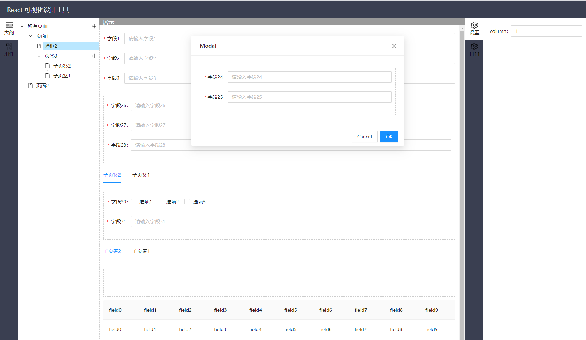
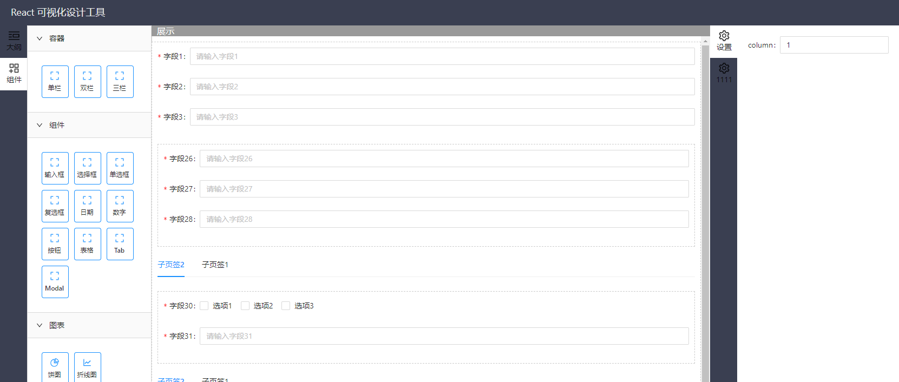
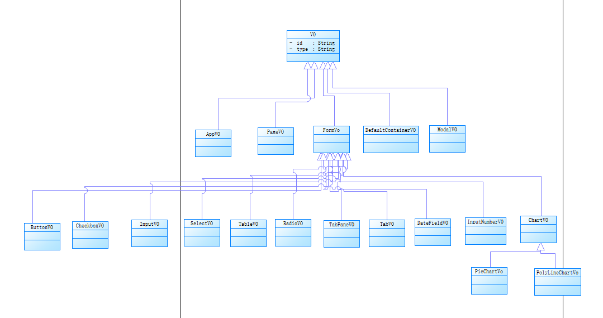

# react 可视化设计工具

首先声明这是一个demo项目，因为是个人写的，精力有限。不过厚着脸皮求赞和收藏

内部有块递归逻辑没有写，也没计划继续改。






## 工程结构

```js
├─build                                        // 编译目录
│  └─static
│      ├─css
│      └─js
├─public                                       // 静态资源
└─src
    ├─assets                                   // 页面资源
    ├─common                                   // 公共层
    ├─components                               // 组件层
    │  ├─Charts                                // 图标组件层
    │  │  ├─JVPieChart
    │  │  └─JVPolylineChart
    │  ├─DefaultContainer                      // 默认容器
    │  └─JVToolTab
    └─pages 
        ├─JVEdit                               // 编辑器
        │  ├─JVLeftTool                        // 左侧工具栏
        │  │  └─JVCompTool
        │  ├─JVMain                            // 主界面
        │  └─JVRightTool                       // 右侧工具栏
```


## 数据结构

详见 `common/vo.js`

### VO结构定义



### VO逻辑结构

```js
AppVO                           // 应用VO
 - PageVO                       // 页面
   - DefaultContainerVO         // 页面默认容器
    - InputVO                   // 输入框
    - SelectVO                  // 下拉框
    - ...                       // 省略其他表单项
    - DefaultContainerVO        // 容器嵌套容器
```

